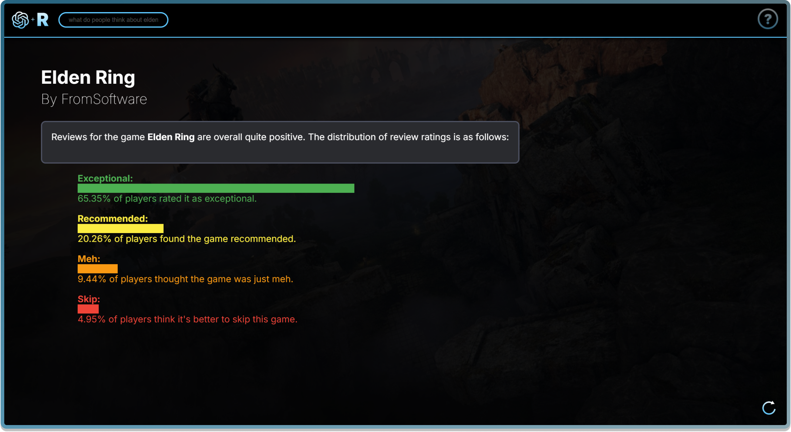
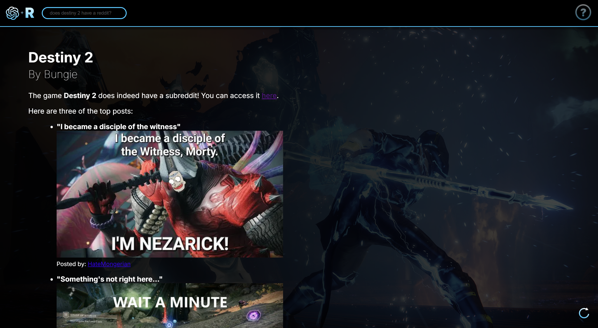
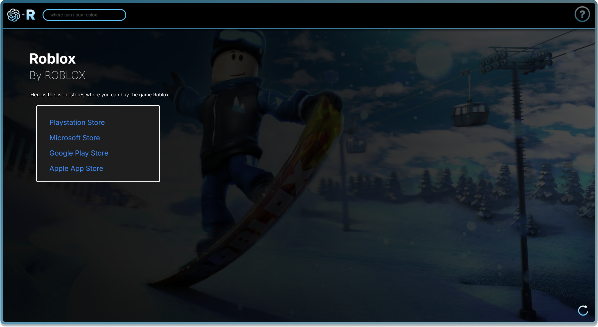
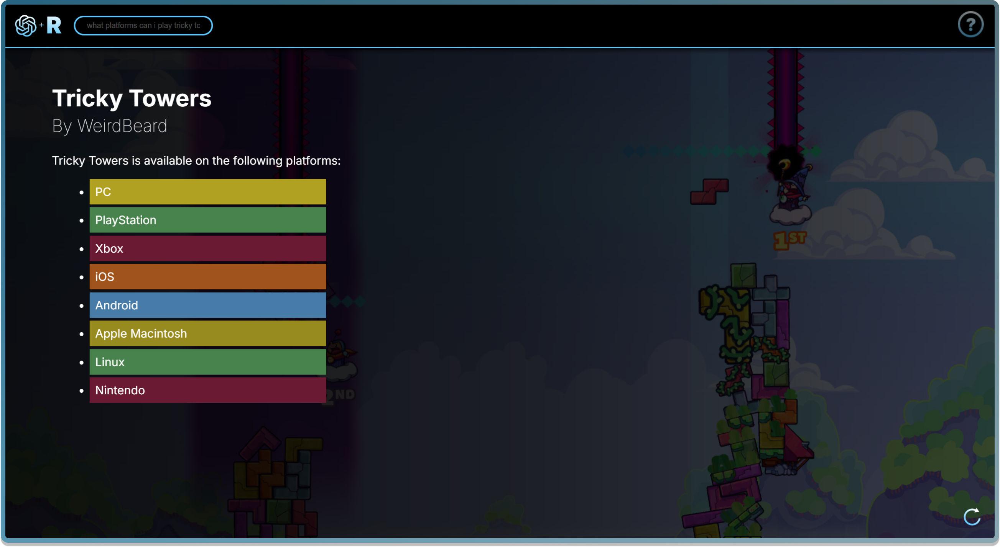

<h2>Game Oracle</h2>

<h5>A truly Customisable and Personalised Game Database experience.</h5>

An OpenAI powered game database that allows you to look up games and find out whatever you want about it whilst OpenAI helps to customise each page around the game you are viewing.


<p>
  <a href="#key-features">Key Features</a> •
  <a href="#how-to-use">How To Use</a> •
  <a href="#prompt-help">Prompt Help</a> •
  <a href="#example-output">Example Output</a> •
  <a href="#purpose">Project Purpose</a> •
  <a href="#known-bugs">Known Bugs</a> •
  <a href="#credits">Credits</a> 
</p>


## Key Features


* **Find Any Game by Title**
  
  - Search for a game title and ask anything about it
  
* **Personalised Descriptions**
  
  - Ask the Bot what a game is and expect a personalised description that matches the games story and feel
  
* **Find Game Stores**

  - Find where you can buy games you want to purchase with direct links

* **Find Game Communities**

  - Find out whether or not a game has a Reddit community to get involved and ask some questions before purchasing

* **Find Out What People Think**

  - Ask the Bot what players think of a specific game for real community ratings and opinions

* **Compare Games**

  * Compare two games and see which game suits you more

* **Custom Background**

  - Watch as the Webpage changes to the video game you are researching

* **See Game Achievements**

  * Find out what achievements a game has and see how difficult they are to achieve

* **See Game Platforms**

  * See what platforms you can play your desired game on

* **Game Genres**

  * See what categories your favourite game exists within

* **Find Most Popular Games By Year**

  * Find what the most popular game was during a specific year!

* **Conversational Experience**

  - Have a conversation about the game and see what you find out!

    

## How To Use


Before trying to run this application, please ensure you install all of the correct libraries to a virtual environment.

0. **Clone Repository & Install Requirements**:

   After cloning the repository to your desired location, please pip install all of the requirements to a virtual environment.

   ``` python
   pip install -r requirements.txt
   ```

1) **Set up your Azure Key & Endpoint**:

   Firstly, ensure you have an OpenAI Azure account with a key and endpoint.

   After this, modify *main.py* to access these values and set them to the `api_key` and `azure_endpoint` variables.

   > **Note**
   >
   > By base, the Key & Endpoint are being read by the OS which can be defined within your command prompt. Keep these values secure and safe.
2. **Set up your RAWG API Account:**

   Set up an [API Account](https://rawg.io/) on RAWG io and then login.

   When you are logged in, go to the [developer portal](https://rawg.io/apidocs) to access your personal *API key*.

   Ensure that these are being read correctly by the bot.py script.

   

   > **Note**
   >
   > Keep your RAWG Key private and secure

3. **Read your RAWG Key:**

   Within the project directory, create a new folder called `keys` and create a new JSON file named `rawg_keys`.

   Copy paste the text below and replace `YOUR_KEY_HERE` with **your RAWG key**.

   ```json
   {
       "client_key": "YOUR_KEY_HERE",
       "base_url": "https://api.rawg.io/api/games"
   }
   ```

   ```cmd
   └── rawg-openai-project/
       ├── venv/...
       ├── static/...
       ├── templates/...
       ├── app.py
       ├── main.py
       └── keys/
           └── rawg_keys.json
   ```

   

4. **Run Flask:**

   Run the Flask app within your command prompt by typing `flask run`.

   > **Note:**
   >
   > Ensure you have your virtual environment active when doing so

5. **Explore Some Games:**

   Feel free to now look up some games and get the information you want!


## Prompt Help


If you are struggling with getting the correct data back, this may be down to your **prompt** wording.

To ensure you are using proper prompts, please ensure you refer to the **Help Page** located on the top right hand side of the webpage. 

Alternatively, below are some **Prompt Examples**:


**Descriptions**

To find the description of a game, use prompts like:

- *"What is the game Destiny 2?"*

- *"Describe what Minecraft is"*

**Reviews & Ratings**

To get game reviews and ratings, use prompts like:

- *"What do people think about Fall Guys?"*

- *"Do people enjoy playing Dead by Daylight?"*

**Subreddit**

To check if a game has a subreddit, use prompts like:

- *"Does The Casting of Frank Stone have a subreddit?"*

- *"What is Fortnite's reddit?"*

**Stores**

To see where you can buy a game, use prompts like:

- *"Where can I buy Still Wakes The Deep?"*

- *"How much is Call of Duty Cold War?"*

**Platforms**

To see what platforms a game is available on, use prompts like:

- "*"What platforms can I play RD2 on?"*"
- "*What platforms are Minecraft on?*"

**Genres**

To see what genres correspond to a game title, use prompts like:

- "*"What genre is Silent Hill?"*"
- "*What type of game is Gartic Phone?*"

**Achievements**

To see what achievements a game of choice has, use prompts like:

- "*"What achievements does Far Cry 4 have?"*"
- "*How many achievements does Halo Reach have?*"

**Comparisons**

To compare two games, use prompts like:

- *"What do people prefer more? Elden Ring or Rainbow 6 Siege?"*

- *"What game is better between Skyrim and Dark Souls?"*


> **Note**
>
> Once you are discussing a particular game, you do not need to reference the title explicitly in the question again since OpenAI will remember the game you are referring to.
>
> For example, if you ask '*What is **Roblox**?*' you can then follow up by simply asking '*What do people think about **this** game?*'
>
> This allows for smooth and seamless conversations with a natural progression.


## Example Output


**Asking about a game**

*Prompt: "what is a liars bar game about?"*


**Reviews & Ratings**

*Prompt: "what did people think about still wakes the deep?"*



**Communities & Subreddits**

*Prompt: "what is elden rings reddit?"*



**Stores / Where to Buy**

*Prompt: "where can i buy The Casting of Frank Stone?"*



**Platforms**

*Prompt: "What platforms can I play Destiny 2 on?"*



**Game Genres**

*Prompt: "what genre is titanfall 2"*


**Achievements**

*Prompt: "what achievements does call of duty blacks ops 2 have?"*


**Comparing Games**

*Prompt: "what do people prefer more, dead by daylight or outlast the trials?"*


## Purpose


This OpenAI x RAWG project was set as part of the CTA Program with WPP. I had a week and a half to develop a Flask application that integrated OpenAI alongside another API of choice to allow AI to access real-time data that it may not have known about.

The purpose of this project was to showcase how OpenAI could be integrated into a website to allow for a customisable browsing experience. In this case, I merged the OpenAI API with the RAWG API to create a game database that alters based on the game title that the user is searching.

Another powerful benefit to the integration of OpenAI within the confines of a website is the conversational tone that it allows the user to bring. For example, instead of looking up a specific games description, then re-searching the same title to find it's reviews, OpenAI remembers what game was most recently searched and thus can infer what you are searching for.

I also experimented a lot with pushing OpenAI to format itself when presenting information. The power of this exists within the time saved for the web developer.

This project was a fun learning experience whilst also demonstrating the future of real-time personalised websites.


## Known Bugs


Below are a list of known bugs and issues to avoid to make your user experience more smooth and streamlined:

**1. Error 400 | Bad Request Error**

- Occasionally, a prompt will send out a 400 Error and fail. If you encounter this error, please relaunch the flask app and ask your question again and it should run fine. If this error persists, please try and rephrase your prompt.

**2. Unreadable Text**

- Sometimes, an output may have both a white background and white text. If you run into this accessibility issue, please try and re-search the game.

  OpenAI tries its best to curate a format that matches the games description and sometimes prioritises this over accessibility.
  If the issue persists, re-search the game and add to the end '***Please make the text black and box white*.**'

  

**3. One Game Studio Showcased**

- When comparing two games together, the site will often only show one the developer of the first game inputted. Please keep this in mind when comparing games.

  


## Credits


This project was capable due to the power of OpenAI and the data provided by RAWG.

Huge thanks to:

- [Azure](https://azure.microsoft.com/en-gb/pricing/purchase-options/azure-account/search?icid=free-search&ef_id=_k_CjwKCAiA3ZC6BhBaEiwAeqfvyjldSpYmnBiBxu3p14RMM4OA8yQiS7emMeiyQpGL3UymUj-DJfJwYxoCEGsQAvD_BwE_k_&OCID=AIDcmm3bvqzxp1_SEM__k_CjwKCAiA3ZC6BhBaEiwAeqfvyjldSpYmnBiBxu3p14RMM4OA8yQiS7emMeiyQpGL3UymUj-DJfJwYxoCEGsQAvD_BwE_k_&gad_source=1&gclid=CjwKCAiA3ZC6BhBaEiwAeqfvyjldSpYmnBiBxu3p14RMM4OA8yQiS7emMeiyQpGL3UymUj-DJfJwYxoCEGsQAvD_BwE)
- [RAWG.io](https://rawg.io/)
- [Kat Sullivan]()
